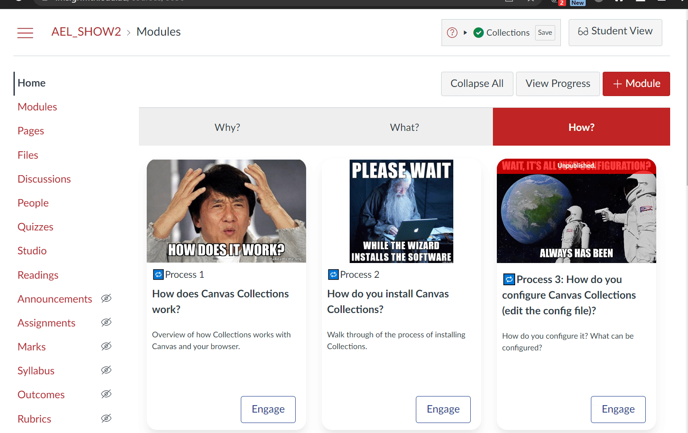

# usable-canvas-userscript

:construction: Very much under construction. Not ready for use. :construction:

Template build for developing mods to Instructure's Canvas LMS using Svelte

Based on [canvas-collections](https://github.com/djplaner/canvas-collections) in turn based on [tampermonkey-svelte](https://github.com/lpshanley/tampermonkey-svelte#readme) this template aims to provide a usable build method for developing Javascript modifications to the [Canvas LMS](https://canvaslms.instructure.com/lp/lms/).

The template seeks to provide

1. Quick and painless developer experience.
2. Support for both production modifications that can be adopted both
   1. Institutionally using [Canvas theme editor](https://community.canvaslms.com/t5/Admin-Guide/How-do-I-create-a-theme-for-an-account-using-the-Theme-Editor/ta-p/242) and hence available to anyone using that Canvas instance.
   2. Individually as a [userscript](https://en.wikipedia.org/wiki/Userscript) with [TamperMonkey](https://www.tampermonkey.net/) or similar and hence enabling initial testing and individual adoption. 

## Template features 

- npm as the package management
- rollup as the bundler
- Local development using Chrome
- [Material for MkDocs](https://squidfunk.github.io/mkdocs-material/) for documentation

## Template structure

- `dev`
- `dist`
- `docs`
- `src`
- `meta.js`
- `mkdocs.yml`
- `package.json`
- `README.md`
- `rollup.build.config.js`
- `rollup.config.js`
- `tsconfig.json`

## Template usage

### Getting started

1. Clone the template repository
2. `npm install`
3. Modify settings

### Modify settings

1. Pick a name for your App and rename `App.svelte` and other stuff??
2. Update the name of the repo in `meta.js`

## Example

As an example, the existing code produces a script that adds a `hello world` message to the top of the _Modules_ and _Rubrics_ pages of a Canvas course.

